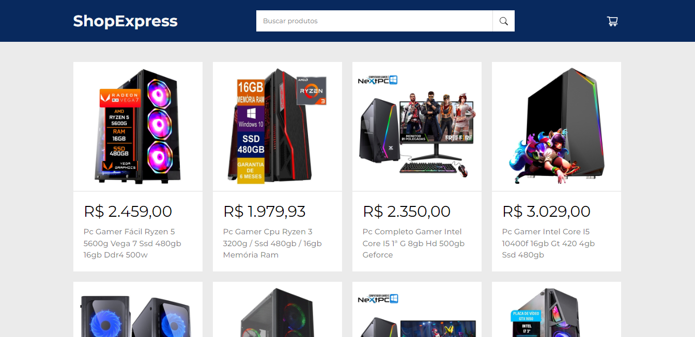

# ShopExpress - Carrinho de Compras com React JS

Bem-vindo ao ShopExpress, o lugar perfeito para você viver uma experiência de compras online simplesmente incrível! Com o nosso projeto de carrinho de compras desenvolvido com React JS, você vai desfrutar de funcionalidades que vão facilitar a sua vida na hora de encontrar e adquirir os produtos que você deseja. Prepare-se para se surpreender!

## Funcionalidades Fantásticas

- **Explore uma ampla variedade de produtos**: nossa plataforma exibe uma lista completa de produtos obtidos da API do Mercado Livre, para que você possa descobrir as melhores ofertas e encontrar exatamente o que procura.

- **Busca personalizada e inteligente**: utilize a nossa ferramenta de busca por palavras-chave para encontrar os produtos específicos que você deseja. Com a integração da API do Mercado Livre, nossos resultados são precisos e atualizados.

- **Adicione seus produtos favoritos**: encontrou algo que adorou? Com apenas um clique, você pode adicionar os produtos ao seu carrinho de compras e seguir em frente com suas compras sem interrupções.

- **Controle total sobre o seu carrinho**: quer remover um item do seu carrinho? Sem problemas! Nossa plataforma permite que você remova facilmente os produtos indesejados, garantindo que você tenha exatamente o que deseja.

## Tecnologias de Última Geração

- **React JS**: uma biblioteca JavaScript poderosa que permite a criação de interfaces de usuário dinâmicas e interativas, garantindo uma navegação suave e eficiente.

- **HTML5**: a linguagem de marcação que estrutura todo o conteúdo do projeto, fornecendo uma base sólida para uma experiência consistente.

- **CSS3**: a linguagem de estilo que dá vida ao design da interface do usuário, tornando-a atraente, amigável e visualmente impressionante.

- **API do Mercado Livre**: integramos a API do Mercado Livre para obter dados atualizados e detalhados sobre os produtos, garantindo que você tenha as informações mais relevantes ao seu alcance.

## Resultado

https://shopexpress-dev.netlify.app/

